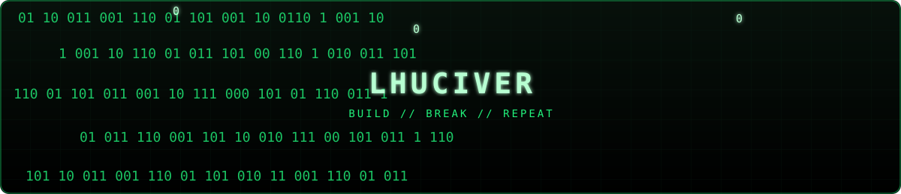

<div align="center">
  
</div>

<br>

<div align="center">
  <a href="https://pokehub.ilhamriski.com/lhuciverjobs-ui">
    
  </a>
</div>

<h2 align="center">hey there! i'm lhuciver 👋</h2>

<p align="center">
  a curious builder from Indonesia who likes turning strange ideas into working software.
</p>

<p align="center">
  <a href="https://github.com/lhuciverjobs-ui?tab=repositories">repositories</a> ·
  <a href="https://pokehub.ilhamriski.com/lhuciverjobs-ui">PokeHub card</a> ·
  <a href="https://t.me/lhuciverjobs">telegram</a>
</p>

<br>

<!-- profile -->

```sh
lhuciver@matrix: ~/profile (main⚡)$ whoami
```

<table>
  <tr>
    <td width="36%" valign="top">
      
    </td>
    <td width="64%" valign="top">

```text
lhuciver's profile
--------------------------------
Name:       lhuciver
Class:      builder / tinkerer
Type:       Python
Location:   Indonesia

Interests:
  - web interfaces
  - automation & useful scripts
  - AI-assisted development
  - game systems & modding
  - Web3 experiments

Current quest:
  build something useful,
  then make it feel good to use.

Status:     open to interesting work
```

I enjoy the part where an idea is still rough, the tools are being chosen, and nothing works on the first try. AI helps me move faster; the second draft is where I make it mine.

    </td>
  </tr>
</table>

<br>

---

<h2 align="center">🧠 about me</h2>

<div align="center">

| | |
|:---|:---|
| 🔭 building | LhuciverJobs UI and small web tools |
| 🐍 main language | Python |
| 🧩 interested in | interfaces, automation, AI tools, games |
| 🌱 learning | better systems, cleaner UX, sharper code |
| 🎴 character card | [PokeHub](https://pokehub.ilhamriski.com/lhuciverjobs-ui) |

</div>

<br>

---

<h2 align="center">🛠 language & tools</h2>

<div align="center">
  
</div>

<br>

<div align="center">
  
  
  
  
  
  
</div>

<br>

---

<h2 align="center">⚡ active projects</h2>

| Project | What it is | Stack |
|:---|:---|:---|
| **LhuciverJobs UI** | Interactive UI for monitoring task queues and background work. | `Ember.js` · `Tailwind CSS` |
| **TempMail Fullstack** | A temporary email experience with a real-time inbox workflow. | `Next.js` · `Node.js` |
| **AI OCR Processor** | Extracts text from batches of images. | `Python` · `Tesseract` |
| **Account Automator** | Browser automation experiments built around repeatable workflows. | `Python` · `Selenium` |

<br>

<div align="center">
  <a href="https://github.com/lhuciverjobs-ui?tab=repositories">
    
  </a>
</div>

<br>

---

<h2 align="center">📊 statistics</h2>

<div align="center">
  
</div>

<br>

<div align="center">
  
</div>

<br>

---

<h2 align="center">📫 find me</h2>

<div align="center">
  <a href="https://lhuciver.lovable.app/">portfolio</a> ·
  <a href="https://lhuciverjobs.webkus.com/">personal site</a> ·
  <a href="https://t.me/lhuciverjobs">telegram</a> ·
  <a href="https://github.com/lhuciverjobs-ui">github</a>
</div>

<br>

<div align="center">
  <sub>green rain, yellow cards, and code that gets better after the first attempt.</sub>
</div>

<br>

<div align="center">
  
</div>

<!-- Structure follows the profile-style references shared by lhuciver. -->
<!-- Matrix header: ./matrix.svg -->
<!-- PokeHub card: https://pokehub.ilhamriski.com/lhuciverjobs-ui -->
